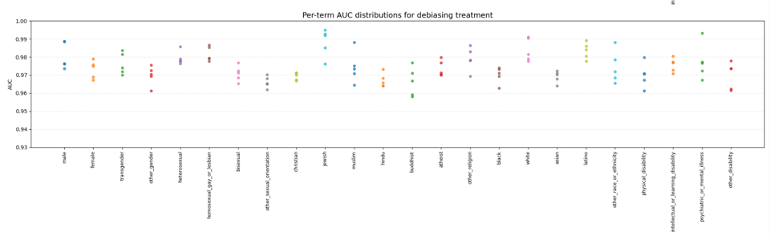
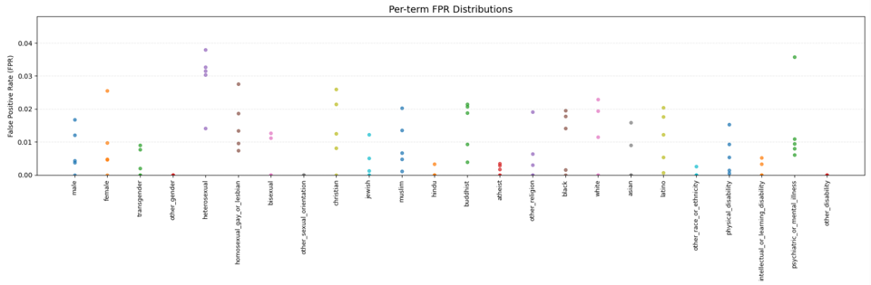
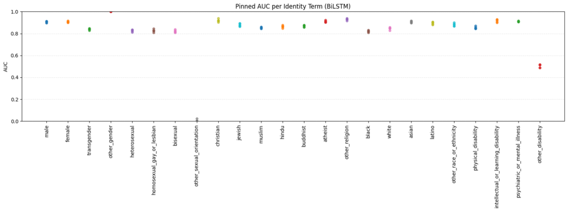
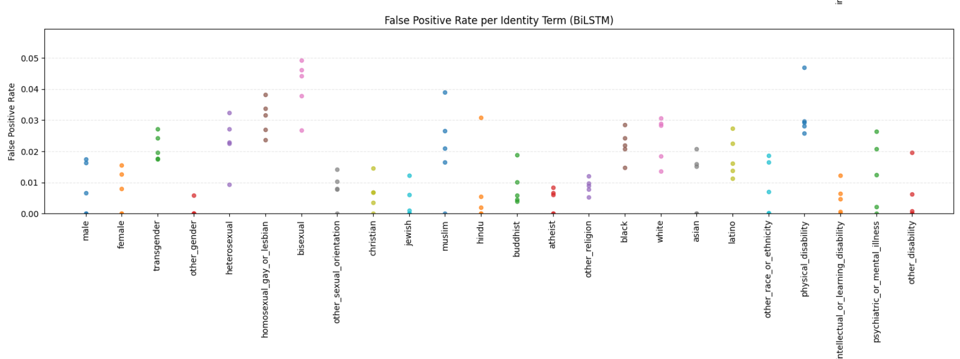
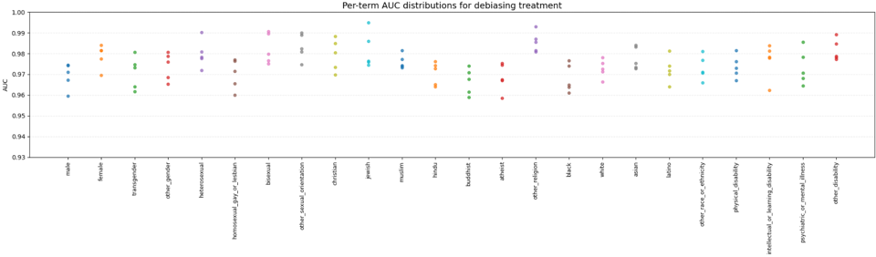
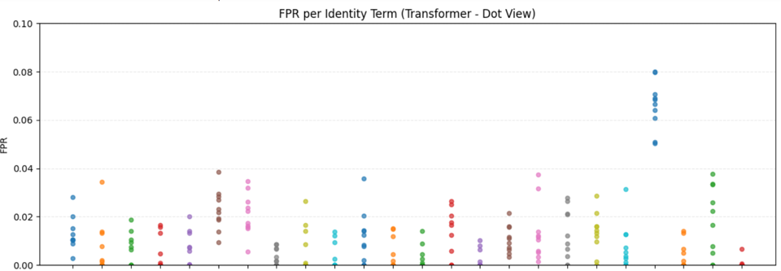
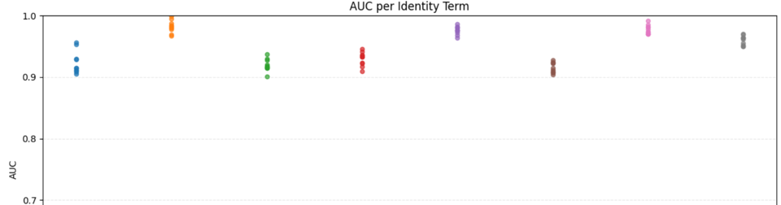
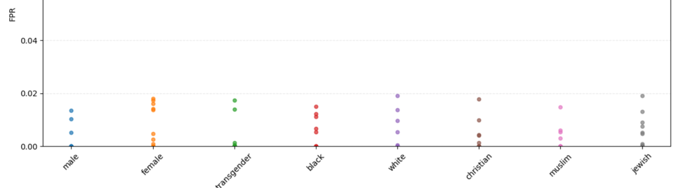

# 🧠 Measuring and Mitigating Unintended Bias in Toxic Text Classification

## 📌 Overview
This project addresses **unintended bias** in toxic comment classification using different deep learning architectures: **LSTM, BiLSTM, Transformer Encoder**, and **Transformer with Attention + Embedding**. We evaluate model fairness across identity subgroups such as “Black”, “gay”, and “Muslim”, and attempt to reduce that bias through architecture design.

---

## 📊 Dataset

- Source: Kaggle (2M+ user comments)
- Labels: Toxic / Non-toxic
- Identity attributes: gender, religion, race, etc.
- Challenge: 90% toxic / 10% non-toxic (imbalanced)

### 🧹 Preprocessing Included
- Text cleaning: URLs, emojis, special characters, lowercase
- Synonym replacement on 20% of identity words
- Tokenization:
  - LSTM: Keras tokenizer
  - Transformer: MiniLM CLS embeddings (`sentence-transformers/all-MiniLM-L6-v2`)
- Identity-weighted loss setup for fair training

---

## 🧠 Models Compared

| Model | Accuracy | Loss | AUC | Notes |
|-------|----------|------|-----|-------|
| LSTM | 0.70 | 0.24 | High (>0.9) | Simple, consistent, fair |
| BiLSTM | 0.69 | 0.25 | ~0.85 | High variance in subgroup errors |
| Transformer Encoder | 0.70 | 0.25 | >0.85 | Moderate fairness |
| Transformer + Embedding | **0.71** | **0.20** | **>0.9** | ✅ Best fairness and performance |

---

## 📉 Evaluation Metrics

- **ROC-AUC**: General classification performance
- **Subgroup AUC**: Fairness across identity groups
- **FPR**: False positives on non-toxic subgroup comments
- **FNR**: False negatives on toxic subgroup comments

---

## 🔬 Key Contributions

- Explored **architectural bias mitigation**, not just evaluation
- Implemented **synonym balancing** and identity-aware loss
- Achieved strong performance using **Transformer + Embedding** with identity metadata
- Plotted and compared subgroup fairness across all models

---

## 🧪 Technologies Used

- Python 3.x
- TensorFlow, Keras
- Hugging Face Transformers
- Pandas, NumPy, Scikit-learn
- Matplotlib, Seaborn
- Google Colab (GPU)

---
## 🧠 Future Ideas

- Try BERT or DeBERTa for deeper context understanding
- Use adversarial debiasing or fairness regularizers
- Expand to multilingual toxic datasets
- Fine-tune with human-in-the-loop fairness correction

---

## 👤 Author

Mujahid — NLP & AI Enthusiast | Final Year CS 
Zeeshan — NLP & AI Enthusiast | Final Year CS 
Talha — NLP & AI Enthusiast | Final Year CS 
Bilal — NLP & AI Enthusiast | Final Year CS 
Rabail — NLP & AI Enthusiast | Final Year CS 

📧 Personal Email: mujahidtufail726@gmail.com

---

## 📊 Evaluation Graphs

### LSTM Results
  
*Figure: AUC distribution per identity term for LSTM model.*

  
*Figure: False Positive Rate per identity term for LSTM model.*

---

### BiLSTM Results
  
*Figure: AUC per identity term for BiLSTM model.*

  
*Figure: False Positive Rate per identity term for BiLSTM model.*

---

### Transformer Encoder Results
  
*Figure: AUC per identity term for Transformer Encoder model.*

  
*Figure: False Positive Rate per identity term for Transformer Encoder model.*

---

### Transformer with Embedding Results
  
*Figure: AUC per identity term for Transformer with Embedding model.*

  
*Figure: False Positive Rate per identity term for Transformer with Embedding model.*

## 📊 Dataset

- Source: [Jigsaw Unintended Bias in Toxicity Classification (Kaggle)](https://www.kaggle.com/datasets/julian3833/jigsaw-unintended-bias-in-toxicity-classification)  
- 2M+ user comments labeled for toxicity and identity subgroups

## 🏷️ Tags

`NLP` `Bias Mitigation` `Toxic Comment Classification` `LSTM` `Transformers` `Fair AI`
